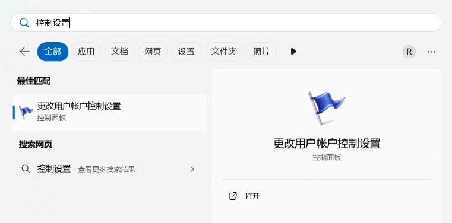
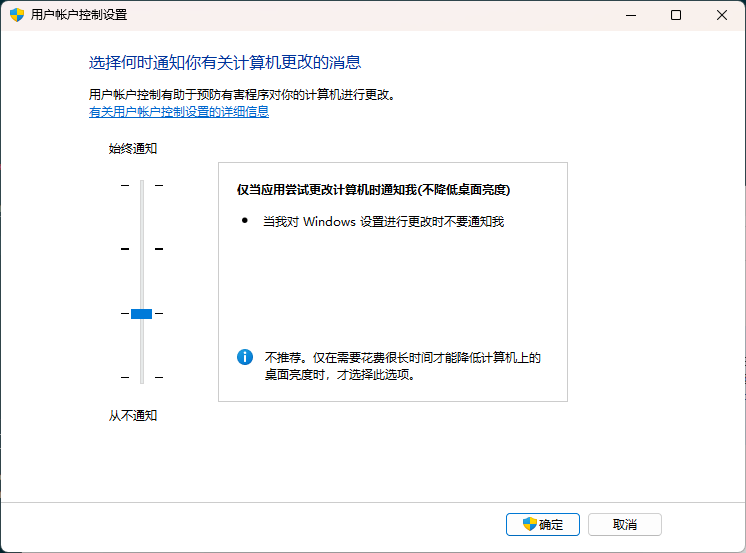

## 打开控制设置

首先打开 <kbd>Win</kbd> **开始菜单**，搜索**控制设置**，选择**更改用户账户控制设置**。

若找不到可以通过 **控制面板** - **用户账户** - **用户账户** - **更改用户账户控制设置**打开。

## 修改控制设置

接着修改控制设置为第三个选项 —— **仅当应用尝试更改计算机时通知我（不降低桌面亮度）**，然后点击确定即可。

