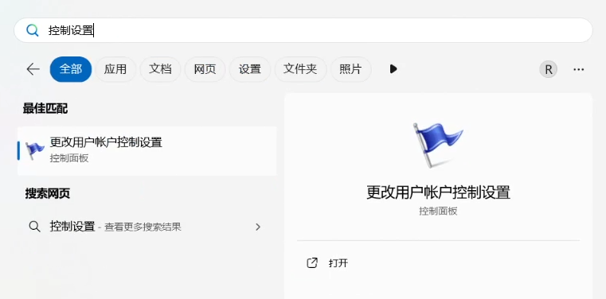
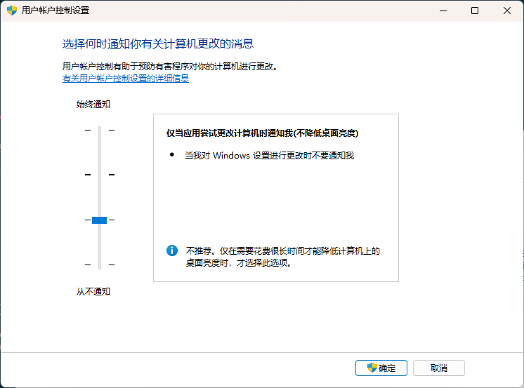

## 打開控制設置

首先打開 <kbd>Win</kbd> **開始菜單**，搜索**控制設置**，選擇**更改用戶賬戶控制設置**。

若找不到可以通過 **控制面板** - **用戶賬戶** - **用戶賬戶** - **更改用戶賬戶控制設置**打開。

## 修改控制設置

接著修改控制設置為第三個選項 —— **僅當應用嘗試更改計算機時通知我（不降低桌面亮度）**，然後點擊確定即可。

